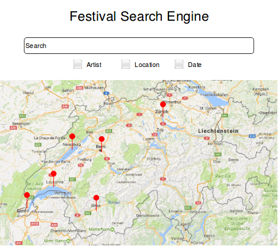
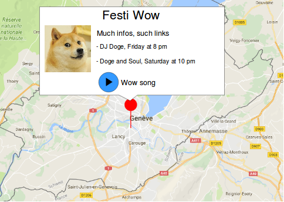

# Festival Search Engine

## Installation and run
You can access it via [this URL](http://eracnos.ch). 
Examples of routes and doc are [here](http://eracnos.ch/routes.html).

To run locally, you need Node.js with npm and MongoDB installed. In terminal, move to `src` and run :
  ```
  npm install
  npm start
  ```
You need to have an instance of MongoDB running too.
Next, open `http://localhost:8080/` in your browser.

## Features


- Welcome page with a search textbox and a swiss google map with a (cached) list of all main swiss festival as markers

  - API Route : Eventful (GET /events/search with this parameters : position, categories, dates)
  - Search : Eventful for performers, BandsInTown for artist's Facebook or images, MusicBrainz (maybe for later) to get more important stuff. Use Eventful for date and BandsInTown can complement Eventful, especially when searching an artist. Search can be made by artist and location and updates the markers displayed on the map. API Route :
    - Eventful : GET /events/search
    - BandsInTown : GET /artists/{artistname}/events
  - BandsInTown also helps to get thumb images of groups.



- Hovering over a marker displays in a bubble main infos about the Festival

  - API : Google map for marker hover and Eventful infos to display

- Clicking on a marker displays informations about the event, the lineup, and plays a preview song of one artist of the lineup in a mini player
  - Eventful to get artist ressources and MusicBrainz for important informations


### Optional features
- Click on the artist of a displayed lineup to perform a search with this artist

## Technical stuff
- Frontend will be coded in HTML and JS mainly
- Backend will be done through Node.js and Express. The server will be connected to a MongoDB database to cache the previews URL and maybe other stuff.
- We decided not to use JamBase as it is not free and seems to give less informations than Eventful. We'll manage to go through the categories of the search.
